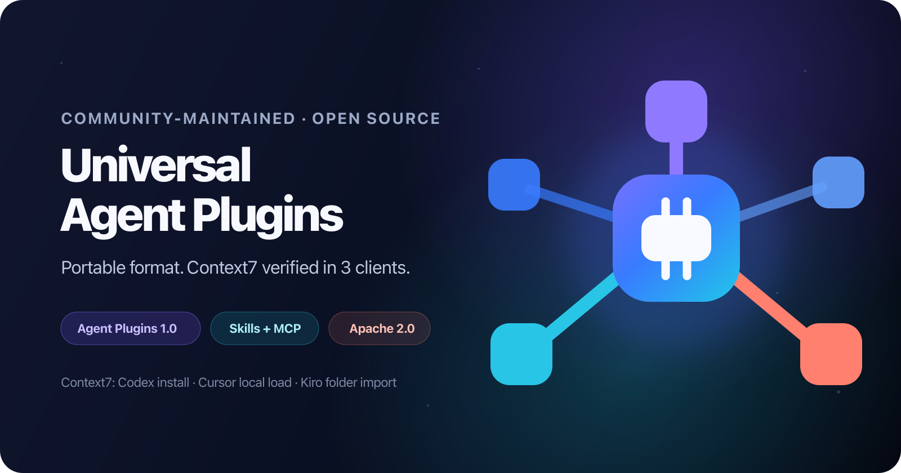

# Universal Agent Plugins

[](https://github.com/777genius/universal-agent-plugins/actions/workflows/validate.yml)
[](https://github.com/777genius/universal-agent-plugins/actions/workflows/live-e2e.yml)
[](https://agent-plugins.org/specification)
[](LICENSE)

Give your AI agent ready-made abilities: search current documentation, navigate
code, debug browsers, work with cloud tools, and more. Pick one plugin and add
others only when you need them.

This repository contains 26 open-source plugins packaged for the
[Agent Plugins 1.0](https://agent-plugins.org/specification) standard.
Portable packages use a root `plugin.json`. For OpenAI hosts, CI generates
official-layout `.codex-plugin/plugin.json` packages under
[`compat/openai`](compat/openai), validates them with OpenAI's `plugin-creator`,
and follows the [OpenAI plugin build guide](https://developers.openai.com/plugins/build/plugins).
The installer below is a community CLI, not an OpenAI product.

The installer is open source and maintained in
[`777genius/plugin-kit-ai`](https://github.com/777genius/plugin-kit-ai).
`universal-agent-plugins` is the npm package; `agentplugins` is the installed
command. Its shared Go engine reads standard `plugin.json` packages and uses
client-specific adapters for Codex, ChatGPT, Cursor, GitHub Copilot/VS Code,
and Kiro.

## Try one plugin

Context7 is an easy first choice. It finds current library documentation and
requires no account. You need Node.js 22 or newer:

```bash
npx universal-agent-plugins add context7
```

The CLI detects Codex, Cursor, GitHub Copilot/VS Code, and Kiro. If more
than one is present, choose one from the prompt. To choose directly:

```bash
npx universal-agent-plugins add context7 --target cursor
```

Open a new chat or session in the client you selected and ask:

```text
Use Context7 to find the current Playwright quick start and summarize it with source links.
```

That's it. Every plugin is independent, so you never need to install the whole
catalog or follow a chain of plugins. Client activation and OAuth can still
require a visible confirmation; see the short [client setup guide](docs/QUICKSTART.md).

## All plugins

| Plugins |  |  |
| --- | --- | --- |
|  [Agent Code Navigator](plugins/agent-code-navigator) |  [Atlassian](plugins/atlassian) |  [Chrome DevTools](plugins/chrome-devtools) |
|  [Cloudflare](plugins/cloudflare) |  [Cloudflare Bindings](plugins/cloudflare-bindings) |  [Cloudflare Docs](plugins/cloudflare-docs) |
|  [Cloudflare Observability](plugins/cloudflare-observability) |  [Cloudflare Radar](plugins/cloudflare-radar) |  [Context7](plugins/context7) |
|  [Docker Hub](plugins/docker-hub) |  [Figma](plugins/figma) |  [Firebase](plugins/firebase) |
|  [GitHub](plugins/github) |  [GitLab](plugins/gitlab) |  [Greptile](plugins/greptile) |
|  [Heroku](plugins/heroku) |  [HubSpot CRM](plugins/hubspot-crm) |  [HubSpot Developer](plugins/hubspot-developer) |
|  [Linear](plugins/linear) |  [Neon](plugins/neon) |  [Notion](plugins/notion) |
|  [Sentry](plugins/sentry) |  [Statsig](plugins/statsig) |  [Stripe](plugins/stripe) |
|  [Supabase](plugins/supabase) |  [Vercel](plugins/vercel) |  |

Each one installs separately. See [plugins to try first](docs/HERO_PLUGINS.md)
for copy-ready examples. Exact authentication and test status are in the
[test matrix](docs/TEST_MATRIX.md).

## Use them with your agent

Agent Plugins 1.0 gives every package a shared structure. Compatible clients can
reuse the parts they support, while installation, permissions, and OAuth remain
client-specific.

| Client | Delivery | Activation |
| --- | --- | --- |
|  Codex | Official-layout `.codex-plugin` package | CLI prints the exact activation steps |
|  ChatGPT | Official-layout package + registered app binding | Manual Plugins UI; package-routed Work runtime is not yet proved |
|  Cursor | Native Agent Plugin | Reload, then verify discovery |
|  GitHub Copilot CLI | Native plugin + managed marketplace | Installed and verified automatically |
|  VS Code | Shared Copilot plugin when its CLI is available | Automatic; otherwise the exact setting is shown |
|  Kiro | Native folder package | Follow the exact Power import hint |

All 26 packages pass standard schema validation. Five starter plugins passed
15/15 runtime checks across Codex, Cursor, and Kiro, including Notion OAuth in
all three; Figma OAuth passed separately in Codex. Installation coverage is
broader than runtime coverage, and the standard itself is not a universal
marketplace. See the [test matrix](docs/TEST_MATRIX.md), [verification
report](docs/VERIFICATION.md), and [compatibility guide](docs/COMPATIBILITY.md)
for exact per-client evidence.

## Safety

- Review a plugin's tools and scopes before enabling it.
- Start with read-only tasks, especially after OAuth.
- Never place tokens in `plugin.json`, `mcp.json`, or committed headers.
- A valid package can still expose destructive tools.

See [SECURITY.md](SECURITY.md) for reporting and security boundaries.

## About this project

This repository rebuilds the portable subset of
[`universal-plugins-for-ai-agents`](https://github.com/777genius/universal-plugins-for-ai-agents)
without `plugin-kit-ai` as its authoring layer. Contributions are welcome; see
[CONTRIBUTING.md](CONTRIBUTING.md).

This is an independent community project maintained by 777genius. It is not
affiliated with or endorsed by OpenAI or the vendors represented in the catalog.
Original project material is licensed under [Apache 2.0](LICENSE).
