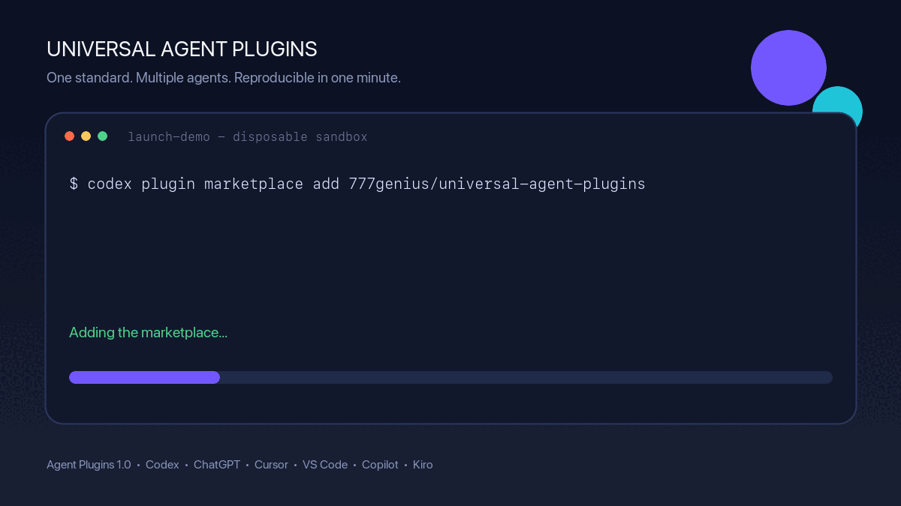

# Universal Agent Plugins

[](https://github.com/777genius/universal-agent-plugins/actions/workflows/validate.yml)
[](https://agent-plugins.org/specification)
[](LICENSE)

Community-maintained packages for the [Agent Plugins 1.0](https://agent-plugins.org/specification) open standard.

This repository rebuilds the portable subset of
[`universal-plugins-for-ai-agents`](https://github.com/777genius/universal-plugins-for-ai-agents)
without `plugin-kit-ai` as its authoring layer. Every source package uses the
standard root `plugin.json`, optional root `mcp.json`, and optional `skills/`
directory.

Because current OpenAI builder documentation still describes the pre-standard
host layout, the repo also contains a generated [OpenAI compatibility
layer](compat/openai/README.md) and repo marketplace. The portable packages are
the only source of truth.

See the [packaging ADR](docs/ADR-0001-portable-core-openai-adapter.md) and the
[public directory submission boundary](docs/OPENAI_SUBMISSION.md) for the exact
difference between compatibility and publication.

## Quick start

### ChatGPT and Codex

Add the GitHub marketplace and install one of the no-auth starter plugins:

```bash
codex plugin marketplace add 777genius/universal-agent-plugins
codex plugin add context7@universal-agent-plugins
```

Start a new Codex session, or restart the ChatGPT desktop app and select the
`Universal Agent Plugins` marketplace in the Plugins Directory.

### Cursor

During local development, copy a portable package directly into Cursor's local
plugin directory:

```bash
mkdir -p ~/.cursor/plugins/local
cp -R plugins/context7 ~/.cursor/plugins/local/context7
```

Open **Customize**, find Context7, select **Install**, and choose user or project
scope. Cursor documents that conformant Agent Plugins load without changes.

See the [full client quick start](docs/QUICKSTART.md) for VS Code, GitHub
Copilot, Kiro, authentication, upgrades, and removal.



## Try these first

| Plugin | Why it is a good first test | Authentication |
| --- | --- | --- |
| [`agent-code-navigator`](plugins/agent-code-navigator) | Four portable code-intelligence skills | None |
| [`context7`](plugins/context7) | Current library documentation over stdio | None |
| [`cloudflare-docs`](plugins/cloudflare-docs) | Public hosted documentation MCP | None |
| [`chrome-devtools`](plugins/chrome-devtools) | Local browser inspection and debugging | Local browser only |

Copy-ready prompts and one-minute walkthroughs are in
[Hero plugins](docs/HERO_PLUGINS.md). Verification status is tracked separately
in the [plugin test matrix](docs/TEST_MATRIX.md) and
[client matrix](docs/CLIENTS.md).

## Why this repository exists

Agent Plugins defines one portable package format for Agent Skills and MCP
servers. Compatible clients currently include ChatGPT and Codex, Cursor, GitHub
Copilot, Kiro, and VS Code, though each client may support a different subset of
components and transports.

The 1.0.0 specification is currently a Working Draft. Client-specific
installation, OAuth, permissions, and marketplace behavior remain outside the
portable core.

The standard deliberately does not define marketplaces, installation UX,
authentication, permissions, sandboxing, or public-directory review. Those
remain client-managed.

## Catalog

The initial catalog contains 26 packages:

| Area | Plugins |
| --- | --- |
| Code intelligence | `agent-code-navigator`, `context7`, `greptile` |
| Browser and design | `chrome-devtools`, `figma` |
| Cloud and deployment | `cloudflare`, `cloudflare-bindings`, `cloudflare-docs`, `cloudflare-observability`, `cloudflare-radar`, `firebase`, `heroku`, `vercel` |
| Source control and planning | `atlassian`, `github`, `gitlab`, `linear`, `notion` |
| Data and backend | `docker-hub`, `hubspot-crm`, `hubspot-developer`, `neon`, `sentry`, `statsig`, `stripe`, `supabase` |

See [compatibility and authentication notes](docs/COMPATIBILITY.md) before
enabling a package. Four legacy Claude-hosted integrations were intentionally
not copied; the rationale and official alternatives are documented in
[known gaps](docs/GAPS.md).

## Package layout

```text
plugins/<plugin-name>/
├── plugin.json      # Required Agent Plugins manifest
├── mcp.json         # Optional portable MCP configuration
├── skills/          # Optional Agent Skills
└── README.md        # Package-specific source and auth notes
```

A minimal manifest looks like this:

```json
{
  "$schema": "https://agent-plugins.org/schemas/1.0.0/plugin.schema.json",
  "name": "example-plugin"
}
```

MCP configuration uses explicit standard transports:

```json
{
  "$schema": "https://agent-plugins.org/schemas/1.0.0/mcp.schema.json",
  "mcpServers": {
    "example": {
      "type": "streamable-http",
      "url": "https://example.com/mcp"
    }
  }
}
```

## Use a plugin

Choose a package under `plugins/` and follow the setup instructions for your
client from the [official compatible-clients list](https://agent-plugins.org/compatible-clients).
Installation and distribution commands are client-specific in Agent Plugins
1.0.

Before enabling an MCP package:

1. Read its `README.md` and upstream documentation.
2. Review the tools and write capabilities exposed by the server.
3. Configure authentication through the client. No package in this repository
   stores credentials.
4. Start with read-only tasks and confirm the account or project scope.

## Validate the catalog

The validator uses only the Python standard library:

```bash
python3 scripts/validate_catalog.py
python3 scripts/build_openai_compat.py --check
python3 scripts/validate_openai_compat.py
python3 -m unittest discover -s tests
```

It checks the closed Agent Plugins schemas, fixed component locations, path
containment, explicit MCP transports, URL rules, forbidden credential
placeholders, dependency pins, and Agent Skills frontmatter.

The current evidence and its limits are recorded in
[docs/VERIFICATION.md](docs/VERIFICATION.md).

## Security boundaries

Agent Plugins standardizes packaging, not trust:

- Path containment is not a subprocess sandbox.
- Remote MCP authentication is client-managed.
- Agent Plugins 1.0 has no portable secrets or OAuth fields.
- A valid package can still expose destructive tools.
- Vendor endpoints, scopes, and behavior can change independently.

Read [SECURITY.md](SECURITY.md) before reporting a sensitive issue.

## Independence and trademarks

This is an independent community project maintained by 777genius. It is not
affiliated with or endorsed by OpenAI or the vendors represented in the catalog.
Vendor names and trademarks belong to their respective owners. Upstream links
and the verification date are listed in [SOURCES.md](SOURCES.md).

## License

The original material in this repository is available under the Apache License
2.0. Third-party servers, services, trademarks, and linked projects remain under
their own terms and licenses.
